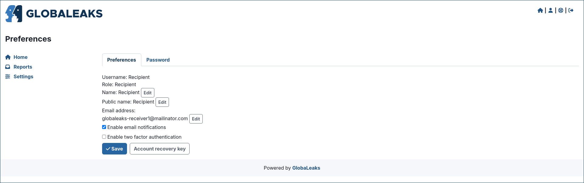
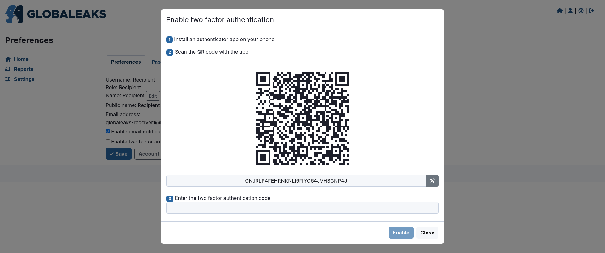
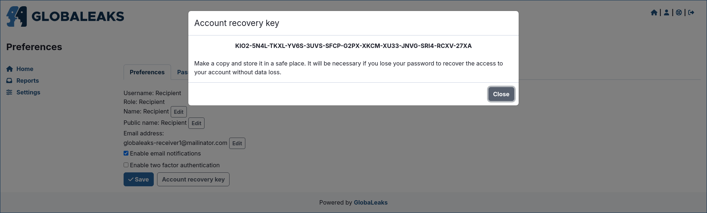

Common to All Users
===================

Login
-----
To log in, navigate to the ``/#/login`` page in your browser.

Access User Preferences
-----------------------
Once logged in, access your preferences by clicking the ``Preferences`` link in the login status bar.

Change Your Password
--------------------
To change your password, go to the ``Password`` tab within the ``Preferences`` page.

Reset Your Password
-------------------
If you forget your password, you can request a reset by clicking the ``Forgot password?`` button on the ``/#/login`` page.

You will then be prompted to enter your username or email address.

Enable Two-Factor Authentication (2FA)
--------------------------------------
Enhance your account security by enabling Two-Factor Authentication (2FA).  
Click the ``Enable two factor authentication`` option inside the ``Preferences`` page.

To use this feature, install an Authenticator app (such as Google Authenticator or Authy) that implements the TOTP standard (`RFC 6238 <https://tools.ietf.org/html/rfc6238>`_).

Access and Back Up Your Account Recovery Key
--------------------------------------------
To prevent account loss, access and securely store your Account Recovery key.  
Find the ``Account Recovery Key`` button in the ``Preferences`` page.

It is strongly recommended to back up your recovery key immediately after activating your account and first login.

